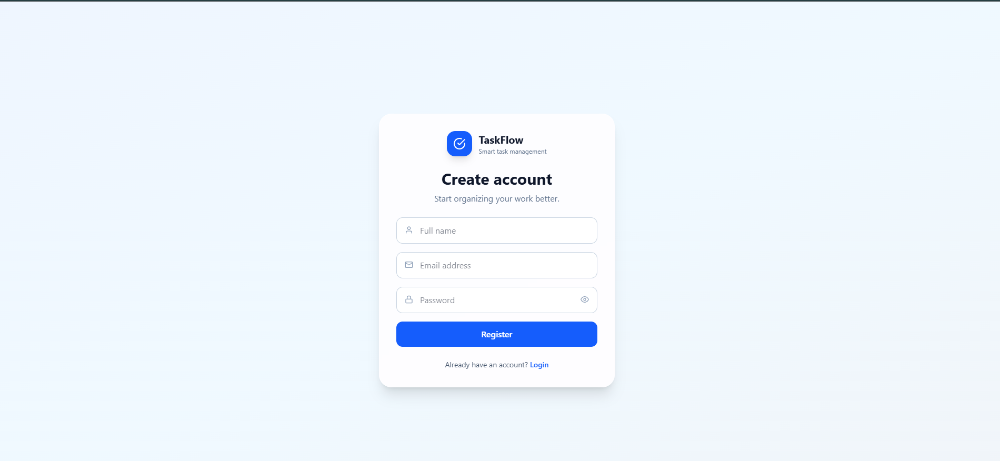
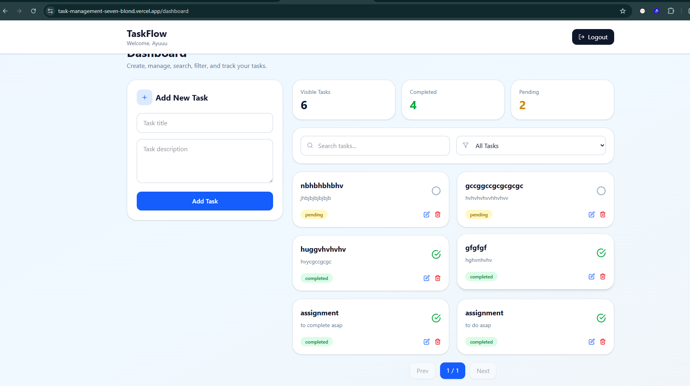
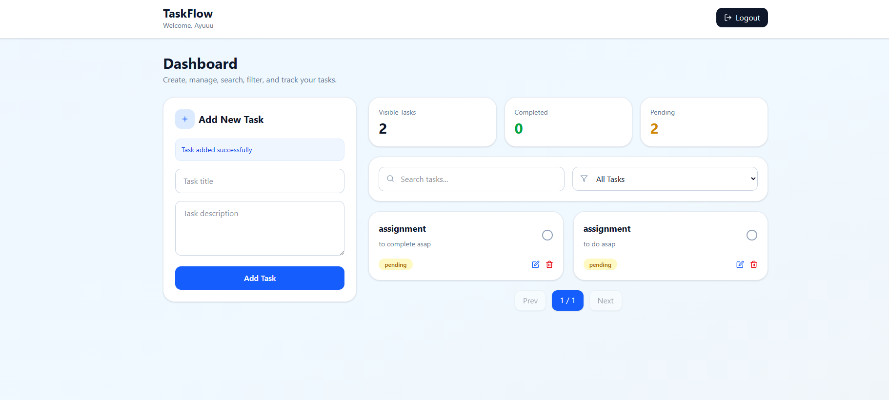
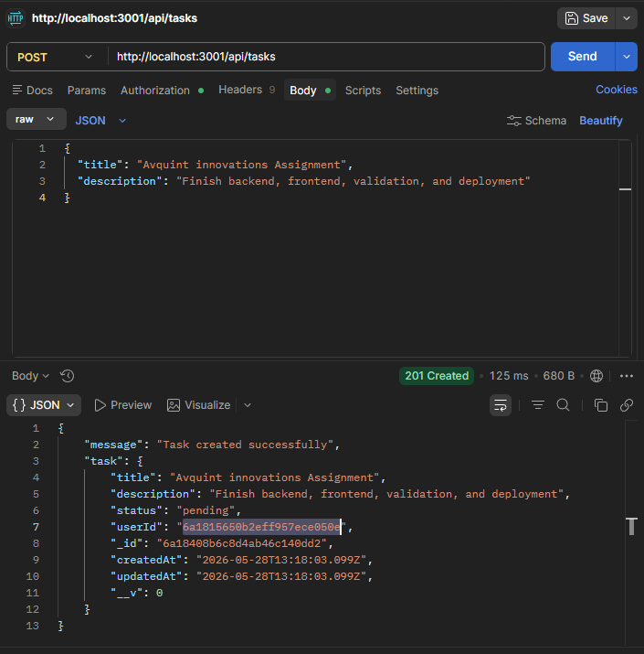
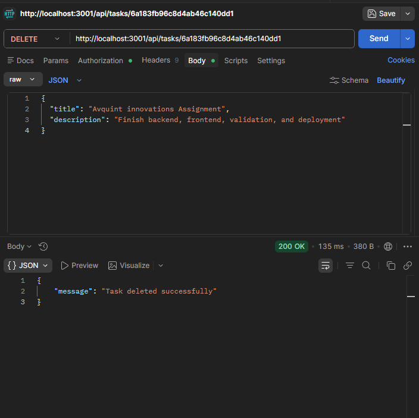
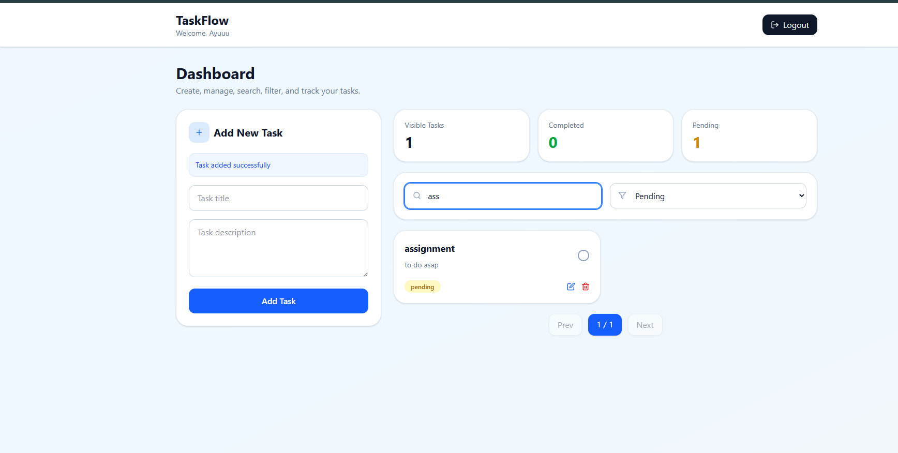
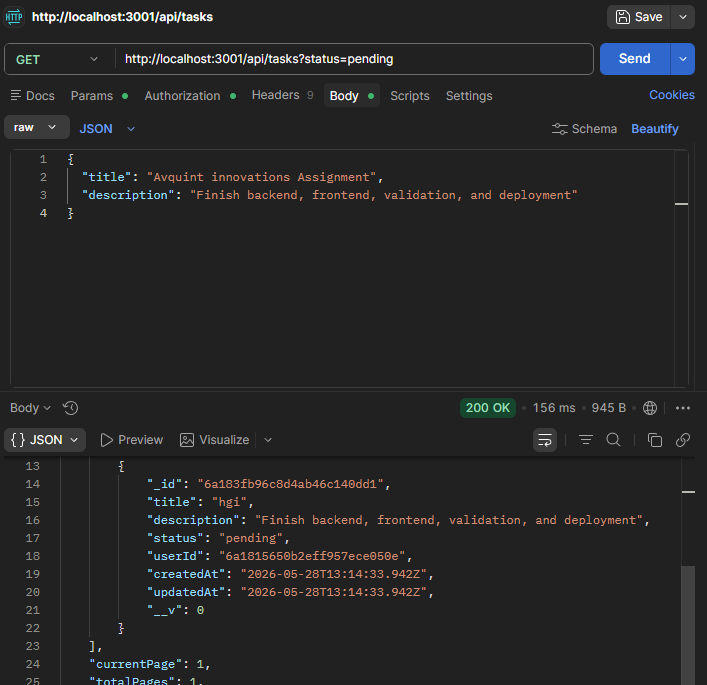
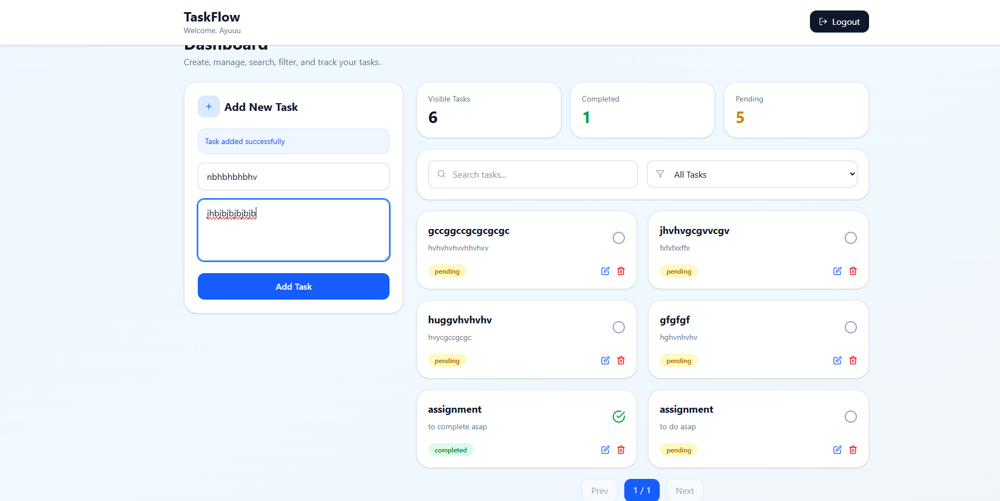

# TaskFlow - Full-Stack Task Management App

TaskFlow is a clean and modern MERN-based task manager that helps users plan work, stay focused, and track progress with ease.

It includes secure authentication, protected APIs, and a responsive dashboard with search, filters, status toggling, and pagination.

## Live Demo

- Frontend (Vercel): https://task-management-seven-blond.vercel.app
- Backend (Render): https://taskmanagement-mn29.onrender.com

## Features

### Authentication
- User registration
- User login
- JWT-based auth (7-day token)
- Protected task routes via Bearer token

### Task Management
- Create tasks
- View tasks
- Edit tasks
- Delete tasks
- Toggle status (`pending` / `completed`)

### Productivity UX
- Search by task title
- Filter by status
- Pagination (`page` + `limit`)
- Responsive dashboard UI
- Client + server-side input validation

## Tech Stack

### Frontend
- Next.js 16
- React 19
- Tailwind CSS 4
- Axios
- React Icons

### Backend
- Node.js
- Express 5
- Mongoose
- JWT (`jsonwebtoken`)
- bcryptjs
- CORS + dotenv

### Database
- MongoDB Atlas

## Project Structure

```text
task-management-app
|
|- BE
|  |- config
|  |- controllers
|  |- middleware
|  |- models
|  |- routes
|  |- utils
|  |- package.json
|  `- server.js
|
|- FE
|  `- t-m-a
|     |- src
|     |  |- app
|     |  |- api
|     |  `- components
|     `- package.json
|
`- README.md
```

## API Overview

Base URL (local): `http://localhost:3001/api`

### Auth Routes

- `POST /auth/register`
- `POST /auth/login`

### Task Routes (Protected)

- `GET /tasks`
- `POST /tasks`
- `PUT /tasks/:id`
- `DELETE /tasks/:id`
- `PATCH /tasks/:id/status`

Auth header for protected routes:

```http
Authorization: Bearer <your_jwt_token>
```

### Task Query Params

`GET /tasks?search=&status=all&page=1&limit=6`

- `search`: case-insensitive title search
- `status`: `all` | `pending` | `completed`
- `page`: page number
- `limit`: items per page

## Validation Rules

### Email
- Must match valid email format
- Example: `user@mail.com`

### Password
- Minimum 7 characters
- At least 1 uppercase letter
- At least 1 number
- At least 1 special character
- Example: `Password@1`

### Task Title
- Must contain meaningful text
- Must include at least one word with 3+ letters
- Junk-only input (symbols/numbers only) is rejected

## Local Setup

### 1) Clone the repository

```bash
git clone https://github.com/Ayushshkhr/taskManagement.git
cd task-management-app
```

### 2) Backend setup

```bash
cd BE
npm install
```

Create `BE/.env`:

```env
PORT=3001
MONGO_URI=your_mongodb_connection_string
JWT_SECRET=your_super_secret_key
NODE_ENV=development
```

Run backend:

```bash
npm run dev
```

### 3) Frontend setup

Open a new terminal:

```bash
cd FE/t-m-a
npm install
```

Create `FE/t-m-a/.env.local`:

```env
NEXT_PUBLIC_API_URL=http://localhost:3001/api
```

Run frontend:

```bash
npm run dev
```

App runs at `http://localhost:3000`

## Deployment

- Frontend: Vercel
- Backend: Render
- Database: MongoDB Atlas

## Assignment Requirements Checklist

### Authentication
- [x] User Registration
- [x] User Login
- [x] JWT Authentication
- [x] Protected Routes

### Task Management
- [x] Create Task
- [x] View Tasks
- [x] Update Task
- [x] Delete Task
- [x] Toggle Task Status

### Frontend
- [x] React Functional Components
- [x] React Hooks
- [x] Responsive UI
- [x] Form Validation
- [x] API Integration

### Backend
- [x] RESTful APIs
- [x] Express.js
- [x] JWT Middleware
- [x] Protected Endpoints

### Database
- [x] MongoDB Atlas
- [x] User Schema
- [x] Task Schema

### Bonus
- [x] Search
- [x] Filter
- [x] Pagination
- [x] Deployment

## Screenshots

### Authentication
- **Register Page**
  

- **Login Page**
  

### Task Management Dashboard
- **Dashboard - List View**
  

- **Dashboard - Full Page**
  

### Task Operations
- **Add Task**
  

- **Delete Task**
  

### Filtering & Search
- **Filter & Search**
  

- **Filter Page**
  

### Pagination
- **Pagination**
  

## Author

Ayush Shekhar
